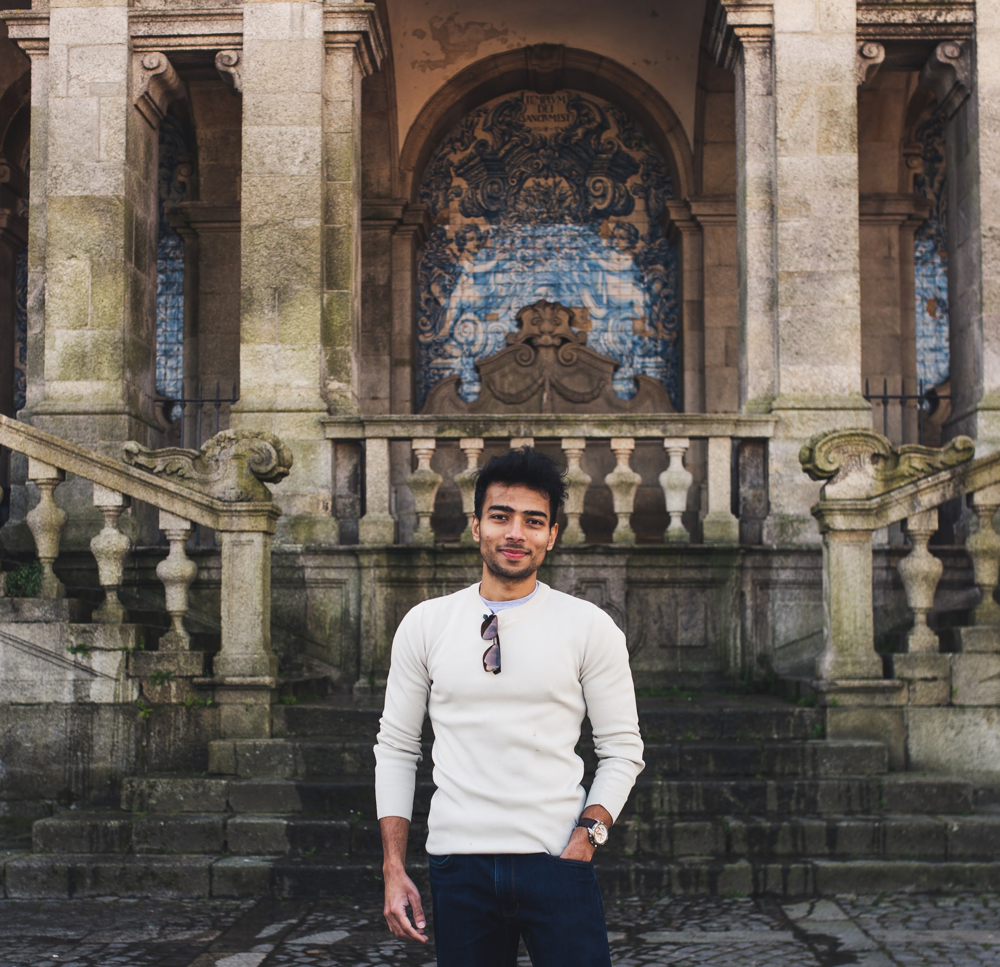

## About Me

Hi! 
I'm the founder of Third Polaris - an early-stage startup bringing modern data pipelines and AI to climate impact companies. 

If you are passionate about climate or would like to leverage AI and tech to solve problems in the space, I'd love to talk :)

Previously, I have worked on AI research and engineering across augmented reality, autonomous driving and drug discovery. 

## Publications

- Paul Scherer, Thomas Gaudelet, Alison Pouplin, Suraj M S, Jyothish Soman, Lindsay Edwards, Jake P. Taylor-King, [PyRelationAL: A Library for Active Learning Research and Development](https://arxiv.org/abs/2205.11117){:target="\_blank"},
  arXiv pre-print, <strong>arXiv:2205.11117</strong>

- Paul Bertin, Jarrid Rector-Brooks, Deepak Sharma, Thomas Gaudelet, Andrew Anighoro, Torsten Gross, Francisco Martinez-Pena, Eileen L. Tang, Suraj M S, Cristian Regep, Jeremy Hayter, Maksym Korablyov, Nicholas Valiante, Almer van der Sloot, Mike Tyers, Charles Roberts, Michael M. Bronstein, Luke L. Lairson, Jake P. Taylor-King, Yoshua Bengio, [RECOVER: sequential model optimization platform for combination drug repurposing identifies novel synergistic compounds in vitro](https://arxiv.org/abs/2202.04202){:target="\_blank"},
  arXiv pre-print, <strong>arXiv:2202.04202</strong>

- Suraj M S, Hugo Grimmett, Lukáš Platinský and Peter Ondrúška, [Visual vehicle tracking through noise and occlusions using crowd-sourced maps](/publications/2018_IROS_1261.pdf){:target="\_blank"},
  Spotlight talk, <strong>2018 IEEE/RSJ International Conference on Intelligent Robots and Systems (IROS 2018), October, 1- 5, 2018 Madrid, Spain</strong>

- Suraj M S, Hugo Grimmett, Lukáš Platinský and Peter Ondrúška, [Predicting trajectories of vehicles using large-scale motion priors](/publications/2018_IV_0596.pdf){:target="\_blank"}, Oral presentation, <strong>2018 IEEE Intelligent Vehicles Symposium (IV) Changshu, Suzhou, China, June 26-30, 2018</strong>

## Patents

- [Enhanced vehicle tracking](https://patents.google.com/patent/US10668921B2/en){:target="\_blank"}, US10668921B2

## Experience
### [Third Polaris](https://www.thirdpolaris.com/){:target="\_blank"}, London, United Kingdom

Co-founder/CEO
 
Jan 2023 - Present 

### [OnDeck Fellow](https://www.beondeck.com/){:target="\_blank"}, Remote

ODF13 cohort
 
Jun 2022 - May 2023 

### [Entrepreneur First](https://www.joinef.com/){:target="\_blank"}, London, United Kingdom

Founder in Residence (LD18)
 
Apr 2022 - May 2022 

### [Relation Therapeutics](https://www.relationrx.com/){:target="\_blank"}, London, United Kingdom

Senior ML Engineer
 
Sep 2021 - Mar 2022 

Research Engineer - ML
 
Nov 2020 - Aug 2021

### [Lyft Level 5 (previously Blue Vision Labs)](https://level5.lyft.com/){:target="\_blank"}, London, United Kingdom

Research Engineer - Computer Vision and Machine Learning
 
Aug 2018 - Apr 2020

### [Blue Vision Labs](https://www.crunchbase.com/organization/blue-vision-labs){:target="\_blank"}, London, United Kingdom

Research Intern
 
May 2017 - Mar 2018

## Education

### [Georgia Institute of Technology](https://www.cc.gatech.edu){:target="\_blank"}, Atlanta, United States

MS Computer Science
 
Aug 2016 - May 2018

### [CGG, Charles University](https://cgg.mff.cuni.cz/){:target="\_blank"}, Prague, Czech Republic

 Research Intern, Computer Graphics Group
 
 Nov 2015 - Jul 2016

### [Universidad de Zaragoza](https://graphics.unizar.es/){:target="\_blank"}, Zaragoza, Spain

Visiting student, Graphics and Imaging Lab
 
Jan 2015 - Jun 2015

### [BITS Pilani](https://www.bits-pilani.ac.in/Goa/){:target="\_blank"}, Goa, India

BE(Hons) Electrical and Electronics
 
Aug 2011 - Jul 2015

